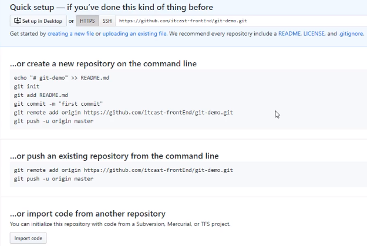
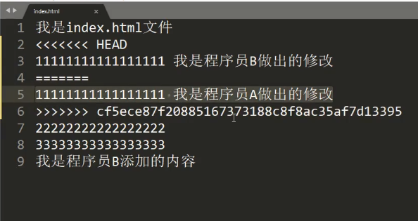
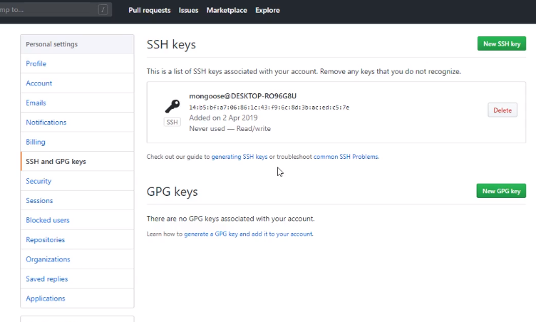
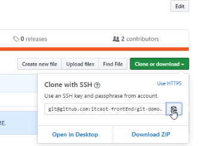

# Git和GitHub详解

## Git基础

### Git 下载和安装

- 下载地址： https://git-scm.com/downloads
- 使用默认值安装
- 资源管理器内单击鼠标右键选择 ` Git Bash Here `
- 输入` git --version ` 检查是否安装成功

### Git 基本工作流程

| git 仓库         | 暂存区               | 工作目录            |
| ---------------- | -------------------- | ------------------- |
| 用于存放提交记录 | 临时存放被修改的文件 | 被Git管理的项目目录 |
| `git commit`     | `git add`            | `git init`          |

### Git使用前的配置

#### 配置用户姓名和邮箱

在使用前告诉git你是谁：

1. 配置姓名 `` $ git config --global user.name xxxx ``

2. 配置邮箱 ` $ git config --global user.email xxxx@xxxx.com `

3. 查看配置是否成功 `` $ git config --list ``  

注意：

1. 更改-->重复上述命令

2. 也可直接修改 `` C:\Users\用户\.gitconfig ``

#### 提交步骤

1. `` git init `` 初始化git仓库
2.  `` git status `` 查看文件状态
3. ` git add 文件列表/文件列表 ` 提交到暂存区
4. `` git commit -m 提交信息 `` 向仓库提交代码
5. `` git log `` 查看提交记录

#### 撤销

* 用暂存区中的文件覆盖工作目录中的文件：`` git checkout -- 文件名 ``  不加 ` -- 文件名 `则覆盖全部文件
* 将文件从暂存区中删除：`` git rm --cached 文件名 ``
* 将git仓库中指定的更新记录恢复出来，并且覆盖暂存区和工作目录：`` git reset --hard commitID``  

#### 修改git commit信息中的author

1. 使用 --amend 修改 author：

   `` git commit --amend --author '用户名<邮箱@xxx.com>' ``

2. 输入`` git rebase --continue  ``结束修改

## Git进阶 

### 分支

生成副本，避免影响开发主线

#### 分支细分

1. 主分支（master）：第一次向git仓库提交更新记录时自动产生的一个分支。
2. 开发分支（develop）：作为开发的分支，基于master分支创建。
3. 功能分支（feature）：作为开发具体功能的分支基于开发分支创建。

#### 分支命令 

- ` git branch ` 查看分支
- ` git branch 分支名称 ` 创建分支
- ` git checkout 分支名称 ` 切换分支
- ` git merge 来源分支 ` 合并分支
- ` git branch -d 分支名称 ` 删除分支（分支合并后才允许被删除）（-D 大写强制删除）

注意：

​		开发分支文件后要commit后再切换主分支，否则分支文件会出现在主分支里面。

### 暂时保存更改

git中可以不提交更改，只提取分支上所有改动并储存，让开发人员得到一个干净的副本，临时转向其它工作。复制到“剪切板”，可以“粘贴“到其它分支。

场景：

- 储存临时改动：` git stash `
- 恢复临时改动：` git stash pop `

## Github

### 注册Github账号

略~

### 多人协作开发流程

- A在自己的计算机中创建本地仓库
- A在GitHub中创建远程仓库
- A将本地仓库推送到远程仓库
- B克隆远程仓库到本地进行开发
- B将本地仓库开发内容推送到远程仓库
- A将远程仓库中的最新内容拉去本地

### 创建仓库

 

### 推送到远程仓库

1. ` git push 远程仓库地址 分支名称 ` 

2. ` git push 远程仓库地址别名 分支名称 `

3. ` git push -u 远程仓库地址别名 分支名称 ` 

   ` -u ` 记住推送地址和分支，下次只需要输入` git push `

4. ` git remote add 远程仓库地址别名 远程仓库地址 `

5. 删除别名：`  git remote remove 远程仓库地址别名  `

6. 第一次提交需要用户名和密码，电脑会记住密码在凭据管理器，第二次就不用了。

### 拉取仓库

#### 克隆仓库

- 克隆远程仓库到本地：` git clone 仓库地址 `

#### 拉取远程仓库中最新版本

- 拉取远程仓库最新版本到本地：` git pull 远程仓库地址 分支名称`

### 解决冲突

多人开发同一个项目时，如果两个人修改了同一个文件同一个地方

1. ` git pull`
2. 手动解决冲突 
3. ` git push` 

### 跨团队协作

1. ` fork`到自己的远程仓库
2. ` clone`到本地进行修改
3. ` push`到远程仓库
4. ` pull request`发送给原作者
5. 原作者查看` commit ` 审核
6. 原作者 ` merge pull request` 

### SSH免密登录

1. 生成密钥：` ssh-keygen`

   密匙储存目录：` C:\User\用户\\.ssh`

   公钥名称：` id_rsa.pub` 

   私钥名称：` id_rsa`

2.  Github添加公钥

   

3. 复制SSH地址：

   

4. 设置ssh别名：`$ git remote add origin_ssh SSH地址 ` 

5. 远程推送：` $ git push origin_ssh master` 

### Git忽略清单

将不需要的文件名字添加到此文件中，执行git 命令时就会忽略这些文件。

- git忽略清单文件名称：` .gitignore `

- 将工作目录所有文件添加到缓存区：` git add .`

### 为仓库添加说明

在仓库根目录添加` readme.md `文件即可